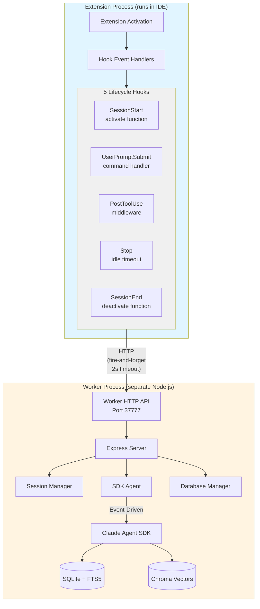
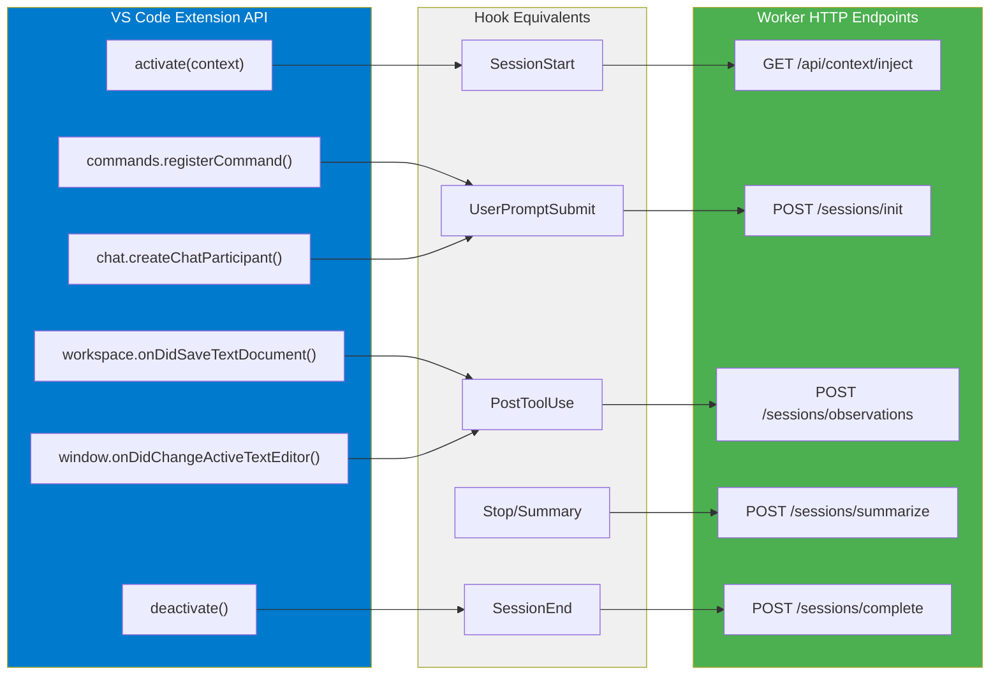
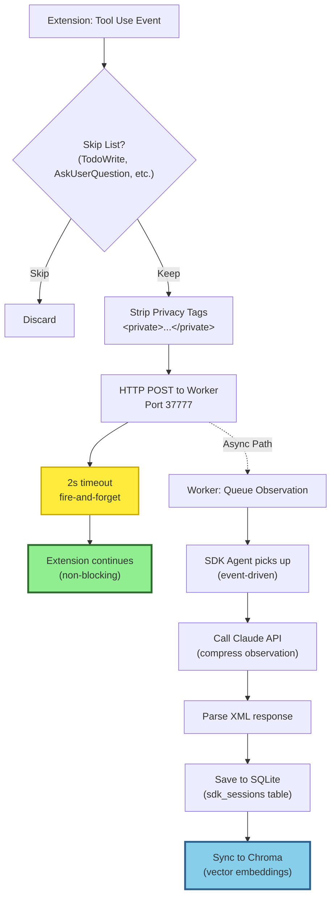
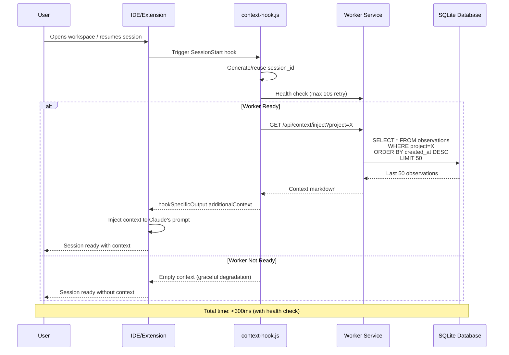
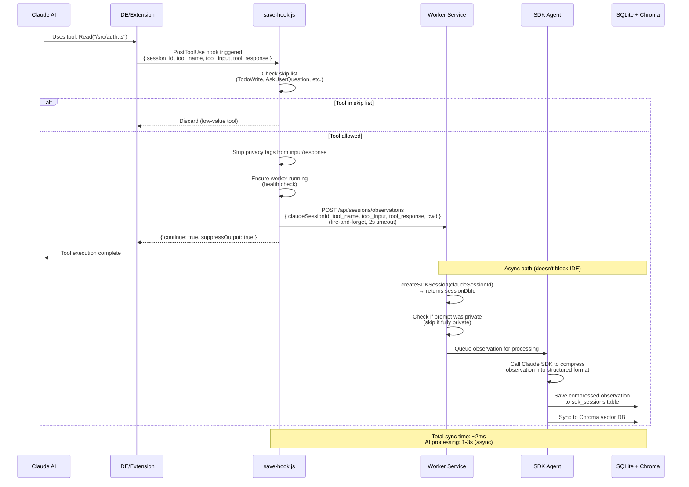
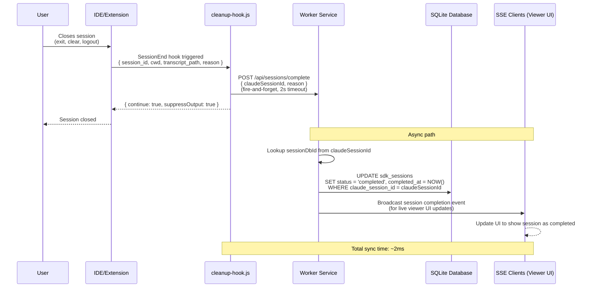
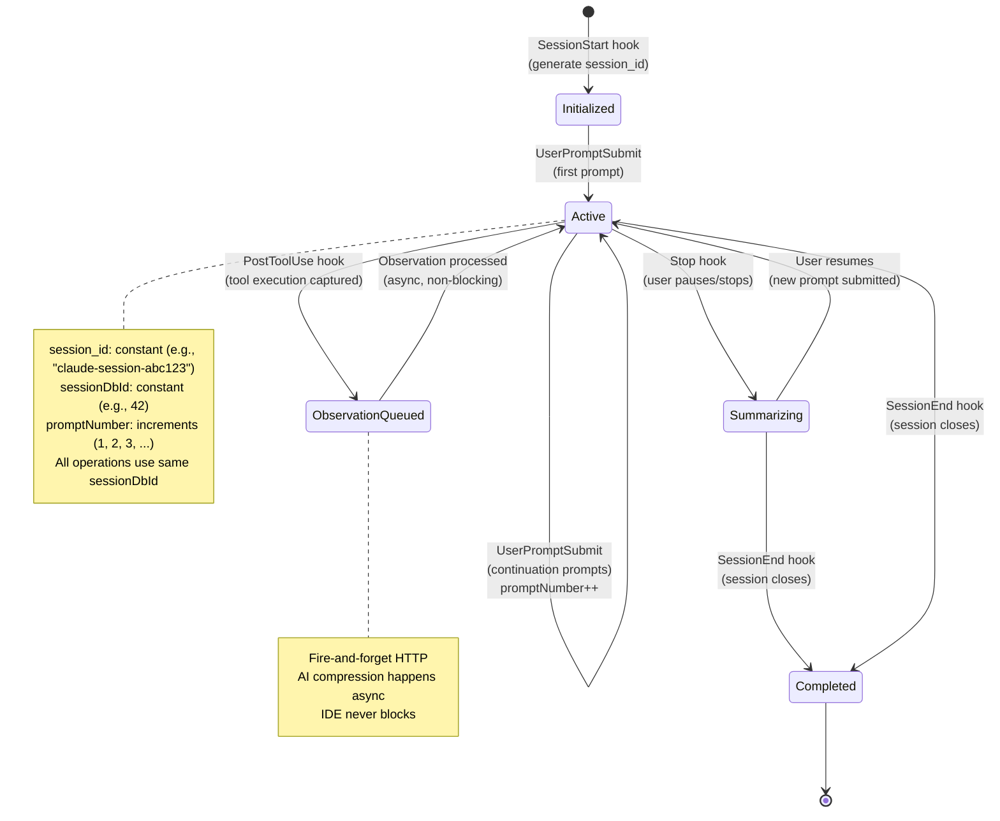
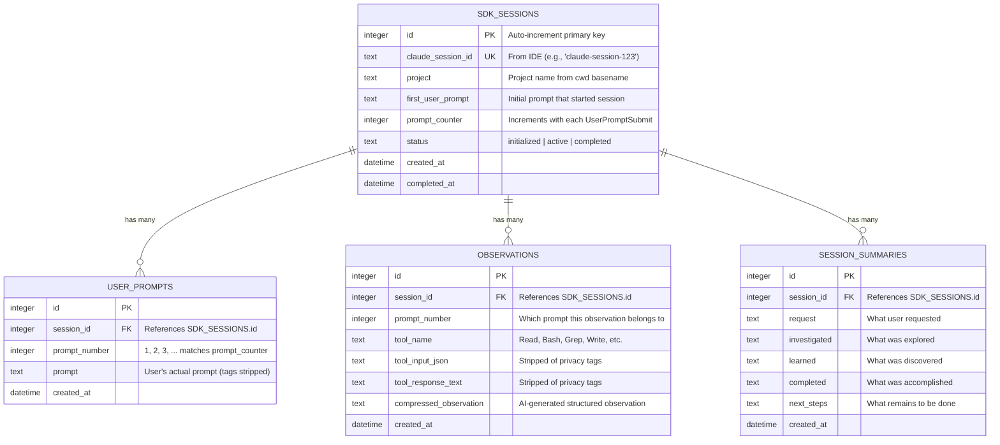

# Hook Lifecycle

Claude-Mem implements a **5-stage hook system** that captures development work across Claude Code sessions. This document provides a complete technical reference for developers implementing this pattern on other platforms.

## Architecture Overview

### System Architecture

This two-process architecture works in both Claude Code and VS Code:



**Key Principles:**
- Extension process never blocks (fire-and-forget HTTP)
- Worker processes observations asynchronously
- Session state persists across IDE restarts

### VS Code Extension API Integration Points

For developers porting to VS Code, here's where to hook into the VS Code Extension API:



**Implementation Examples:**

```typescript
// VS Code Extension - SessionStart Hook
export async function activate(context: vscode.ExtensionContext) {
  const sessionId = generateSessionId()
  const project = workspace.name || 'default'

  // Fetch context from worker
  const response = await fetch(`http://localhost:37777/api/context/inject?project=${project}`)
  const context = await response.text()

  // Inject into chat or UI panel
  injectContextToChat(context)
}

// VS Code Extension - UserPromptSubmit Hook
const command = vscode.commands.registerCommand('extension.command', async (prompt) => {
  await fetch('http://localhost:37777/sessions/init', {
    method: 'POST',
    body: JSON.stringify({ sessionId, project, userPrompt: prompt })
  })
})

// VS Code Extension - PostToolUse Hook (middleware pattern)
workspace.onDidSaveTextDocument(async (document) => {
  await fetch('http://localhost:37777/api/sessions/observations', {
    method: 'POST',
    body: JSON.stringify({
      claudeSessionId: sessionId,
      tool_name: 'FileSave',
      tool_input: { path: document.uri.path },
      tool_response: 'File saved successfully'
    })
  })
})
```

### Async Processing Pipeline

How observations flow from extension to database without blocking the IDE:



**Critical Pattern:** The extension's HTTP call has a 2-second timeout and doesn't wait for AI processing. The worker handles compression asynchronously using an event-driven queue.

## The 5 Lifecycle Stages

| Stage | Hook | Trigger | Purpose |
|-------|------|---------|---------|
| **1. SessionStart** | `context-hook.js` | User opens Claude Code | Inject prior context silently |
| **2. UserPromptSubmit** | `new-hook.js` | User submits a prompt | Create/get session, save prompt, init worker |
| **3. PostToolUse** | `save-hook.js` | Claude uses any tool | Queue observation for AI compression |
| **4. Stop** | `summary-hook.js` | User stops asking questions | Generate session summary |
| **5. SessionEnd** | `cleanup-hook.js` | Session closes | Mark session completed |

## Hook Configuration

Hooks are configured in `plugin/hooks/hooks.json`:

```json
{
  "hooks": {
    "SessionStart": [{
      "matcher": "startup|clear|compact",
      "hooks": [{
        "type": "command",
        "command": "node ${CLAUDE_PLUGIN_ROOT}/scripts/smart-install.js",
        "timeout": 300
      }, {
        "type": "command",
        "command": "bun ${CLAUDE_PLUGIN_ROOT}/scripts/worker-service.cjs start",
        "timeout": 60
      }, {
        "type": "command",
        "command": "bun ${CLAUDE_PLUGIN_ROOT}/scripts/context-hook.js",
        "timeout": 60
      }]
    }],
    "UserPromptSubmit": [{
      "hooks": [{
        "type": "command",
        "command": "node ${CLAUDE_PLUGIN_ROOT}/scripts/new-hook.js",
        "timeout": 120
      }]
    }],
    "PostToolUse": [{
      "matcher": "*",
      "hooks": [{
        "type": "command",
        "command": "node ${CLAUDE_PLUGIN_ROOT}/scripts/save-hook.js",
        "timeout": 120
      }]
    }],
    "Stop": [{
      "hooks": [{
        "type": "command",
        "command": "node ${CLAUDE_PLUGIN_ROOT}/scripts/summary-hook.js",
        "timeout": 120
      }]
    }],
    "SessionEnd": [{
      "hooks": [{
        "type": "command",
        "command": "node ${CLAUDE_PLUGIN_ROOT}/scripts/cleanup-hook.js",
        "timeout": 120
      }]
    }]
  }
}
```

---

## Stage 1: SessionStart

**Timing**: When user opens Claude Code or resumes session

**Hooks Triggered** (in order):
1. `smart-install.js` - Ensures dependencies are installed
2. `worker-service.cjs start` - Starts the worker service
3. `context-hook.js` - Fetches and silently injects prior session context

<Note>
As of Claude Code 2.1.0 (ultrathink update), SessionStart hooks no longer display user-visible messages. Context is silently injected via `hookSpecificOutput.additionalContext`.
</Note>

### Sequence Diagram



### Context Hook (`context-hook.js`)

**Purpose**: Inject context from previous sessions into Claude's initial context.

**Input** (via stdin):
```json
{
  "session_id": "claude-session-123",
  "cwd": "/path/to/project",
  "source": "startup"
}
```

**Processing**:
1. Wait for worker to be available (health check, max 10 seconds)
2. Call: `GET http://127.0.0.1:37777/api/context/inject?project={project}`
3. Return formatted context as `additionalContext` in `hookSpecificOutput`

**Output** (via stdout):
```json
{
  "hookSpecificOutput": {
    "hookEventName": "SessionStart",
    "additionalContext": "<<formatted context markdown>>"
  }
}
```

**Implementation**: `src/hooks/context-hook.ts`

---

## Stage 2: UserPromptSubmit

**Timing**: When user submits any prompt in a session

**Hook**: `new-hook.js`

### Sequence Diagram

```mermaid
sequenceDiagram
    participant User
    participant IDE as IDE/Extension
    participant NewHook as new-hook.js
    participant DB as Direct SQLite Access
    participant Worker as Worker Service

    User->>IDE: Submits prompt: "Add login feature"
    IDE->>NewHook: Trigger UserPromptSubmit<br/>{ session_id, cwd, prompt }

    NewHook->>NewHook: Extract project = basename(cwd)
    NewHook->>NewHook: Strip privacy tags<br/>&lt;private&gt;...&lt;/private&gt;

    alt Prompt fully private (empty after stripping)
        NewHook-->>IDE: Skip (don't save)
    else Prompt has content
        NewHook->>DB: INSERT OR IGNORE INTO sdk_sessions<br/>(claude_session_id, project, first_user_prompt)
        DB-->>NewHook: sessionDbId (new or existing)

        NewHook->>DB: UPDATE sdk_sessions<br/>SET prompt_counter = prompt_counter + 1<br/>WHERE id = sessionDbId
        DB-->>NewHook: promptNumber (e.g., 1 for first, 2 for continuation)

        NewHook->>DB: INSERT INTO user_prompts<br/>(session_id, prompt_number, prompt)

        NewHook->>Worker: POST /sessions/{sessionDbId}/init<br/>{ project, userPrompt, promptNumber }<br/>(fire-and-forget, 2s timeout)
        Worker-->>NewHook: 200 OK (or timeout)

        NewHook-->>IDE: { continue: true, suppressOutput: true }
        IDE-->>User: Prompt accepted
    end

    Note over NewHook,DB: Idempotent: Same session_id → same sessionDbId
```

**Key Pattern:** The `INSERT OR IGNORE` ensures the same `session_id` always maps to the same `sessionDbId`, enabling conversation continuations.

**Input** (via stdin):
```json
{
  "session_id": "claude-session-123",
  "cwd": "/path/to/project",
  "prompt": "User's actual prompt text"
}
```

**Processing Steps**:

```typescript
// 1. Extract project name from working directory
project = path.basename(cwd)

// 2. Create or get database session (IDEMPOTENT)
sessionDbId = db.createSDKSession(session_id, project, prompt)
// INSERT OR IGNORE: Creates new row if first prompt, returns existing if continuation

// 3. Increment prompt counter
promptNumber = db.incrementPromptCounter(sessionDbId)
// Returns 1 for first prompt, 2 for continuation, etc.

// 4. Strip privacy tags
cleanedPrompt = stripMemoryTagsFromPrompt(prompt)
// Removes <private>...</private> and <claude-mem-context>...</claude-mem-context>

// 5. Skip if fully private
if (!cleanedPrompt || cleanedPrompt.trim() === '') {
  return  // Don't save, don't call worker
}

// 6. Save user prompt to database
db.saveUserPrompt(session_id, promptNumber, cleanedPrompt)

// 7. Initialize session via worker HTTP
POST http://127.0.0.1:37777/sessions/{sessionDbId}/init
Body: { project, userPrompt, promptNumber }
```

**Output**:
```json
{ "continue": true, "suppressOutput": true }
```

**Implementation**: `src/hooks/new-hook.ts`

<Note>
The same `session_id` flows through ALL hooks in a conversation. The `createSDKSession` call is idempotent - it returns the existing session for continuation prompts.
</Note>

---

## Stage 3: PostToolUse

**Timing**: After Claude uses any tool (Read, Bash, Grep, Write, etc.)

**Hook**: `save-hook.js`

### Sequence Diagram



**Key Pattern:** The hook returns immediately after HTTP POST. AI compression happens asynchronously in the worker without blocking Claude's tool execution.

**Input** (via stdin):
```json
{
  "session_id": "claude-session-123",
  "cwd": "/path/to/project",
  "tool_name": "Read",
  "tool_input": { "file_path": "/src/index.ts" },
  "tool_response": "file contents..."
}
```

**Processing Steps**:

```typescript
// 1. Check blocklist - skip low-value tools
const SKIP_TOOLS = {
  'ListMcpResourcesTool',  // MCP infrastructure noise
  'SlashCommand',          // Command invocation
  'Skill',                 // Skill invocation
  'TodoWrite',             // Task management meta-tool
  'AskUserQuestion'        // User interaction
}

if (SKIP_TOOLS[tool_name]) return

// 2. Ensure worker is running
await ensureWorkerRunning()

// 3. Send to worker (fire-and-forget HTTP)
POST http://127.0.0.1:37777/api/sessions/observations
Body: {
  claudeSessionId: session_id,
  tool_name,
  tool_input,
  tool_response,
  cwd
}
Timeout: 2000ms
```

**Worker Processing**:
1. Looks up or creates session: `createSDKSession(claudeSessionId, '', '')`
2. Gets prompt counter
3. Checks privacy (skips if user prompt was entirely private)
4. Strips memory tags from `tool_input` and `tool_response`
5. Queues observation for SDK agent processing
6. SDK agent calls Claude to compress into structured observation
7. Stores observation in database and syncs to Chroma

**Output**:
```json
{ "continue": true, "suppressOutput": true }
```

**Implementation**: `src/hooks/save-hook.ts`

---

## Stage 4: Stop

**Timing**: When user stops or pauses asking questions

**Hook**: `summary-hook.js`

### Sequence Diagram

```mermaid
sequenceDiagram
    participant User
    participant IDE as IDE/Extension
    participant SummaryHook as summary-hook.js
    participant Worker as Worker Service
    participant Agent as SDK Agent
    participant DB as SQLite Database

    User->>IDE: Stops asking questions<br/>(pause, idle, or explicit stop)
    IDE->>SummaryHook: Stop hook triggered<br/>{ session_id, cwd, transcript_path }

    SummaryHook->>SummaryHook: Read transcript JSONL file
    SummaryHook->>SummaryHook: Extract last user message<br/>(type: "user")
    SummaryHook->>SummaryHook: Extract last assistant message<br/>(type: "assistant", filter &lt;system-reminder&gt;)

    SummaryHook->>Worker: POST /api/sessions/summarize<br/>{ claudeSessionId, last_user_message, last_assistant_message }<br/>(fire-and-forget, 2s timeout)

    SummaryHook->>Worker: POST /api/processing<br/>{ isProcessing: false }<br/>(stop spinner)

    SummaryHook-->>IDE: { continue: true, suppressOutput: true }
    IDE-->>User: Session paused/stopped

    Note over Worker,DB: Async path

    Worker->>Worker: Lookup sessionDbId from claudeSessionId
    Worker->>Agent: Queue summarization request
    Agent->>Agent: Call Claude SDK with prompt:<br/>"Summarize: request, investigated, learned, completed, next_steps"
    Agent->>Agent: Parse XML response
    Agent->>DB: INSERT INTO session_summaries<br/>{ session_id, request, investigated, learned, completed, next_steps }
    Agent->>DB: Sync to Chroma (for semantic search)

    Note over SummaryHook,DB: Total sync time: ~2ms<br/>AI summarization: 2-5s (async)
```

**Key Pattern:** The summary is generated asynchronously and doesn't block the user from resuming work or closing the session.

**Input** (via stdin):
```json
{
  "session_id": "claude-session-123",
  "cwd": "/path/to/project",
  "transcript_path": "/path/to/transcript.jsonl"
}
```

**Processing Steps**:

```typescript
// 1. Extract last messages from transcript JSONL
const lines = fs.readFileSync(transcript_path, 'utf-8').split('\n')
// Find last user message (type: "user")
// Find last assistant message (type: "assistant", filter <system-reminder> tags)

// 2. Ensure worker is running
await ensureWorkerRunning()

// 3. Send summarization request (fire-and-forget HTTP)
POST http://127.0.0.1:37777/api/sessions/summarize
Body: {
  claudeSessionId: session_id,
  last_user_message: string,
  last_assistant_message: string
}
Timeout: 2000ms

// 4. Stop processing spinner
POST http://127.0.0.1:37777/api/processing
Body: { isProcessing: false }
```

**Worker Processing**:
1. Queues summarization for SDK agent
2. Agent calls Claude to generate structured summary
3. Summary stored in database with fields: `request`, `investigated`, `learned`, `completed`, `next_steps`

**Output**:
```json
{ "continue": true, "suppressOutput": true }
```

**Implementation**: `src/hooks/summary-hook.ts`

---

## Stage 5: SessionEnd

**Timing**: When Claude Code session closes (exit, clear, logout, etc.)

**Hook**: `cleanup-hook.js`

### Sequence Diagram



**Key Pattern:** Session completion is tracked for analytics and UI updates, but doesn't prevent the user from closing the IDE.

**Input** (via stdin):
```json
{
  "session_id": "claude-session-123",
  "cwd": "/path/to/project",
  "transcript_path": "/path/to/transcript.jsonl",
  "reason": "exit"
}
```

**Processing Steps**:

```typescript
// Send session complete (fire-and-forget HTTP)
POST http://127.0.0.1:37777/api/sessions/complete
Body: {
  claudeSessionId: session_id,
  reason: string  // 'exit' | 'clear' | 'logout' | 'prompt_input_exit' | 'other'
}
Timeout: 2000ms
```

**Worker Processing**:
1. Finds session by `claudeSessionId`
2. Marks session as 'completed' in database
3. Broadcasts session completion event to SSE clients

**Output**:
```json
{ "continue": true, "suppressOutput": true }
```

**Implementation**: `src/hooks/cleanup-hook.ts`

---

## Session State Machine

Understanding session lifecycle and state transitions:



**Key Insights:**
- `session_id` never changes during a conversation
- `sessionDbId` is the database primary key for the session
- `promptNumber` increments with each user prompt
- State transitions are non-blocking (fire-and-forget pattern)

---

## Database Schema

The session-centric data model that enables cross-session memory:



**Idempotency Pattern:**

```sql
-- This ensures same session_id always maps to same sessionDbId
INSERT OR IGNORE INTO sdk_sessions (claude_session_id, project, first_user_prompt)
VALUES (?, ?, ?)
RETURNING id;

-- If already exists, returns existing row
-- If new, creates and returns new row
```

**Foreign Key Cascade:**

All child tables (user_prompts, observations, session_summaries) use `session_id` foreign key referencing `SDK_SESSIONS.id`. This ensures:
- All data for a session is queryable by sessionDbId
- Session deletions cascade to child tables
- Efficient joins for context injection

<Warning>
Never generate your own session IDs. Always use the `session_id` provided by the IDE - this is the source of truth for linking all data together.
</Warning>

---

## Privacy & Tag Stripping

### Dual-Tag System

```typescript
// User-Level Privacy Control (manual)
<private>sensitive data</private>

// System-Level Recursion Prevention (auto-injected)
<claude-mem-context>...</claude-mem-context>
```

### Processing Pipeline

**Location**: `src/utils/tag-stripping.ts`

```typescript
// Called by: new-hook.js (user prompts)
stripMemoryTagsFromPrompt(prompt: string): string

// Called by: save-hook.js (tool_input, tool_response)
stripMemoryTagsFromJson(jsonString: string): string
```

**Execution Order** (Edge Processing):
1. `new-hook.js` strips tags from user prompt before saving
2. `save-hook.js` strips tags from tool data before sending to worker
3. Worker strips tags again (defense in depth) before storing

---

## SDK Agent Processing

### Query Loop (Event-Driven)

**Location**: `src/services/worker/SDKAgent.ts`

```typescript
async startSession(session: ActiveSession, worker?: any) {
  // 1. Create event-driven message generator
  const messageGenerator = this.createMessageGenerator(session)

  // 2. Run Agent SDK query loop
  const queryResult = query({
    prompt: messageGenerator,
    options: {
      model: 'claude-sonnet-4-5',
      disallowedTools: ['Bash', 'Read', 'Write', ...],  // Observer-only
      abortController: session.abortController
    }
  })

  // 3. Process responses
  for await (const message of queryResult) {
    if (message.type === 'assistant') {
      await this.processSDKResponse(session, text, worker)
    }
  }
}
```

### Message Types

The message generator yields three types of prompts:

1. **Initial Prompt** (prompt #1): Full instructions for starting observation
2. **Continuation Prompt** (prompt #2+): Context-only for continuing work
3. **Observation Prompts**: Tool use data to compress into observations
4. **Summary Prompts**: Session data to summarize

---

## Implementation Checklist

For developers implementing this pattern on other platforms:

### Hook Registration
- [ ] Define hook entry points in platform config
- [ ] 5 hook types: SessionStart (2 hooks), UserPromptSubmit, PostToolUse, Stop, SessionEnd
- [ ] Pass `session_id`, `cwd`, and context-specific data

### Database Schema
- [ ] SQLite with WAL mode
- [ ] 4 main tables: `sdk_sessions`, `user_prompts`, `observations`, `session_summaries`
- [ ] Indices for common queries

### Worker Service
- [ ] HTTP server on configurable port (default 37777)
- [ ] Bun runtime for process management
- [ ] 3 core services: SessionManager, SDKAgent, DatabaseManager

### Hook Implementation
- [ ] context-hook: `GET /api/context/inject` (with health check)
- [ ] new-hook: createSDKSession, saveUserPrompt, `POST /sessions/{id}/init`
- [ ] save-hook: Skip low-value tools, `POST /api/sessions/observations`
- [ ] summary-hook: Parse transcript, `POST /api/sessions/summarize`
- [ ] cleanup-hook: `POST /api/sessions/complete`

### Privacy & Tags
- [ ] Implement `stripMemoryTagsFromPrompt()` and `stripMemoryTagsFromJson()`
- [ ] Process tags at hook layer (edge processing)
- [ ] Max tag count = 100 (ReDoS protection)

### SDK Integration
- [ ] Call Claude Agent SDK to process observations/summaries
- [ ] Parse XML responses for structured data
- [ ] Store to database + sync to vector DB

---

## Key Design Principles

1. **Session ID is Source of Truth**: Never generate your own session IDs
2. **Idempotent Database Operations**: Use `INSERT OR IGNORE` for session creation
3. **Edge Processing for Privacy**: Strip tags at hook layer before data reaches worker
4. **Fire-and-Forget for Non-Blocking**: HTTP timeouts prevent IDE blocking
5. **Event-Driven, Not Polling**: Zero-latency queue notification to SDK agent
6. **Everything Saves Always**: No "orphaned" sessions

---

## Common Pitfalls

| Problem | Root Cause | Solution |
|---------|-----------|----------|
| Session ID mismatch | Different `session_id` used in different hooks | Always use ID from hook input |
| Duplicate sessions | Creating new session instead of using existing | Use `INSERT OR IGNORE` with `session_id` as key |
| Blocking IDE | Waiting for full response | Use fire-and-forget with short timeouts |
| Memory tags in DB | Stripping tags in wrong layer | Strip at hook layer, before HTTP send |
| Worker not found | Health check too fast | Add retry loop with exponential backoff |

---

## Related Documentation

- [Worker Service](/architecture/worker-service) - HTTP API and async processing
- [Database Schema](/architecture/database) - SQLite tables and FTS5 search
- [Privacy Tags](/usage/private-tags) - Using `<private>` tags
- [Troubleshooting](/troubleshooting) - Common hook issues
